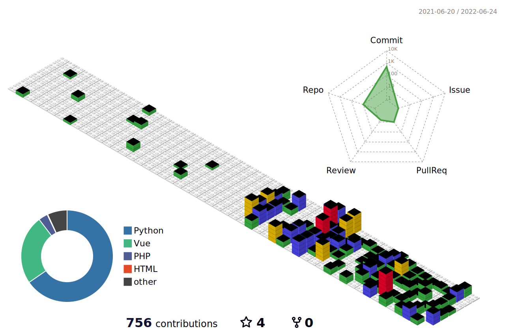

# 👨🏻‍💻 Welcome

<table><tr><td bgcolor=#EDC4E4><b>I am Jimmy🙋🏻‍♂️ , a Python backend engineer.
 
</b></td></tr></table>

    
<b>👇🏻 Personal Interests 👇🏻</b>

- ⌨️ Coding
- 💪🏻 Weight Training
- 🥊 Boxing
- 🕴🏻 Magic
- 🤿 Diving

    
<b>👇🏻 Work Experience 👇🏻</b>

- Chang Gung University (201607~201807)-R.A.
- Taiwan Data Science Co. (201807~202004)-Data Engineer
- Feiwalk Technology Inc. (202004~202110)-Technical Adviser
- Golden Crown Technology Inc. (202004~)-Tech Lead

    
<b>👇🏻 Python Projects 👇🏻</b>

- [flask-api-cache](https://github.com/jimmyyyeh/flask-api-cache)
- [tw-stock-plugin](https://github.com/jimmyyyeh/tw-stock-plugin)
- [screen-master](https://github.com/jimmyyyeh/screen-master)
- [mysql-operator](https://github.com/jimmyyyeh/mysql-operator)
- [mongo-operator](https://github.com/jimmyyyeh/mongo-operator)

    
<b>👇🏻 Side Projects 👇🏻</b>

- [tesla-trip](http://www.tesla-trip.cc)
- [one-day](https://youtu.be/nm0DlTElMSs)

---
### 📊 Contribution

### 📚 Github Stats

<!-- ### 🏆 Github Trophies
 -->

### 📖 LeetCode Stats

### 🎵 Spotify Playing

### 💻 Languages And Tools

 

 

 
 

### 👶🏻 Vistors

### 👍🏻 Support

